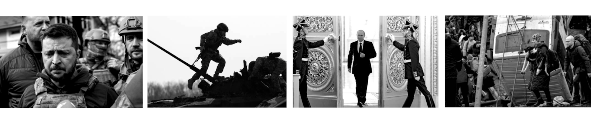
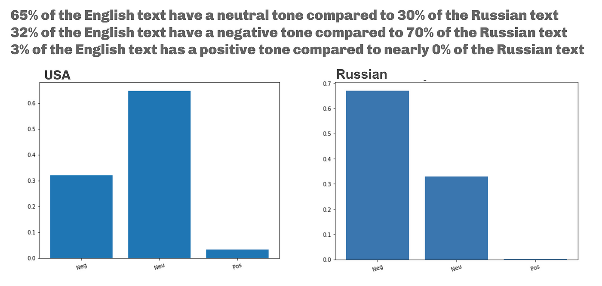
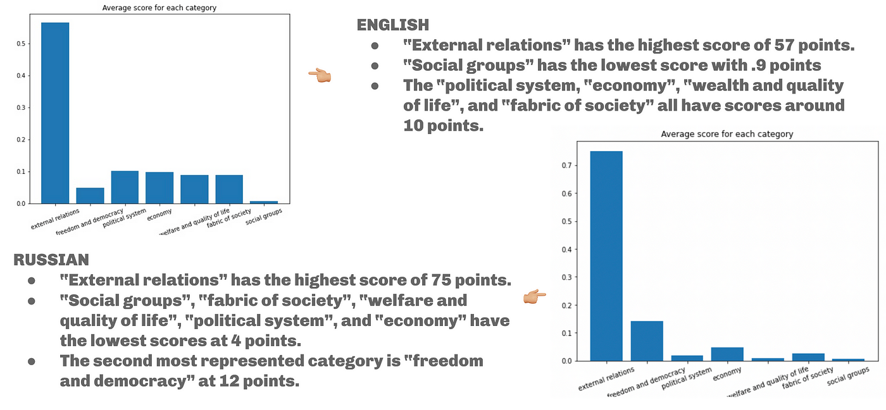
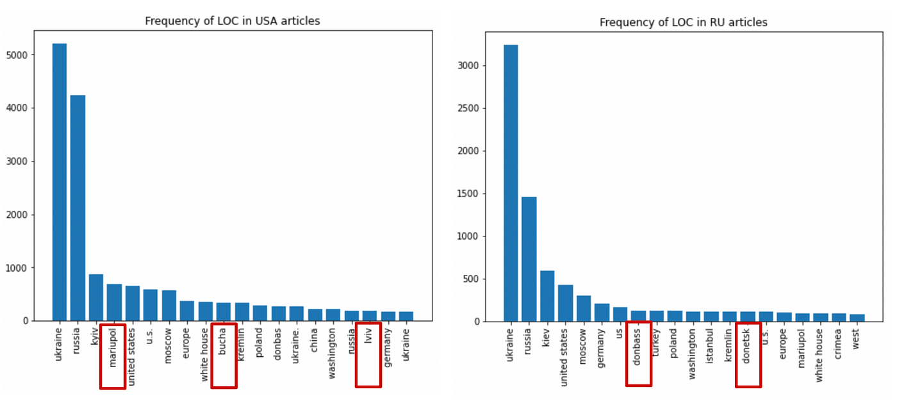
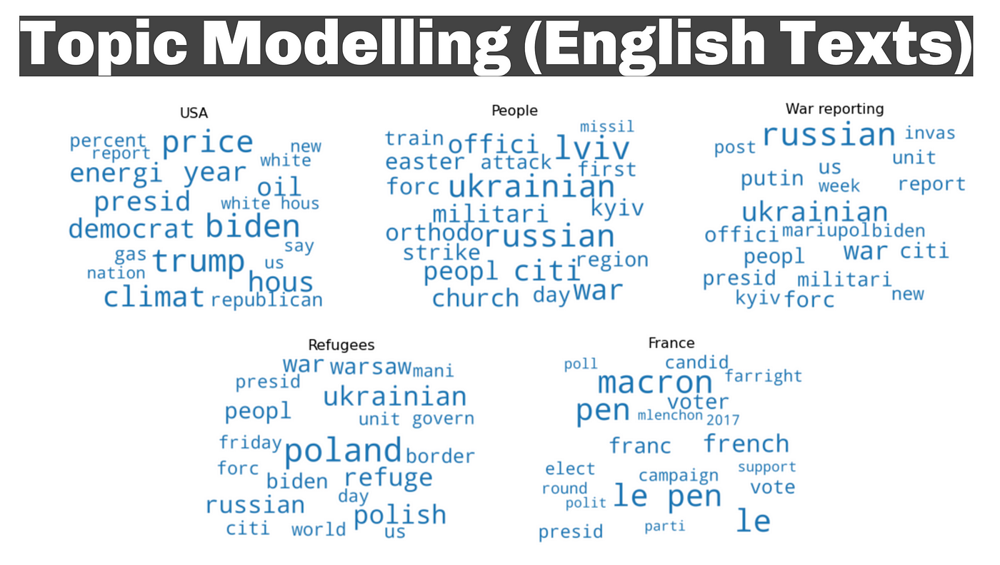
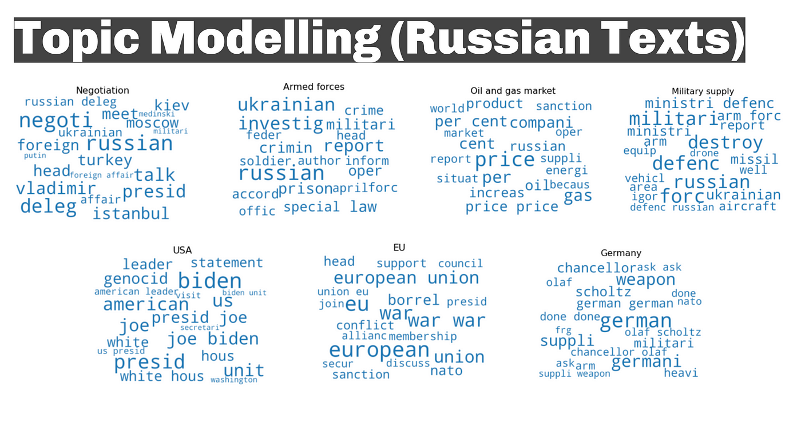

# Information Ecosystem Research Bias in News Coverage
This project is implemented in Team. 

**Team:** Tiffany Lee, Isaiah Muray, Chenran Ning, Anastasia Sorokina

**Professor:** Justin Hendrix

## Project Description

Analyzed the bias in news coverage on the Ukrainian-Russian War between the United States and Russia using sentiment analysis, named entity recognition, topic modeling, and Policy BERT to understand the narrative discrepancies in news coverage and invoke a collective consciousness on the need for truthful news coverage.

**Data:** **3000 full news articles from March 25, 2022 to April 24th 2022** that contain the term or combination of terms, “Ukraine”, “Ukrainian”, “украина”, “украине”, “украиной” (all of which are different variations of “Ukraine”).

This is a course project for INFO 5330: Technology, Media, and Democracy at Cornell Tech.

Chenran implemented `nlp_by_chenran.ipynb` in [Google Colab](https://colab.research.google.com/drive/1K4QYQjjhN0XuaImEH38h9TMH4FWAZKyF?usp=sharing) to utilize multiple NLP models to analyze web-scraped information.

## Project Article

*You can also read this article in [Medium](https://medium.com/@ansorokina163/a-quantitative-analysis-of-the-bias-in-news-coverage-on-the-ukrainian-russian-war-ceffd5842f37)*

**A Quantitative Analysis of the Bias in News Coverage on the Ukrainian / Russian War**

****

### **Project Overview**

In this study we are looking to understand the narrative discrepancies in news coverage between the United States and Russia. Specifically, our project is designed to elicit and compare the known biases across news coverage on the Ukrainian-Russian War using natural language processing (NLP) in both English and Russian languages respectively [[1\]](https://www.zotero.org/google-docs/?meDgx4). As technologists, we recognize that the media ecosystem is rampant with disinformation, news bias, echo chambers, etc. --- largely having transformed to this with the advent of social media and its power to sway perceptions of reality [[2\]](https://www.zotero.org/google-docs/?9FQHTU). In times of humanitarian crisis the media ecosystem is duly responsible for producing (as) accurate information about those in crises --- this is not the case considering the Ukrainian-Russian War [[3\]](https://www.zotero.org/google-docs/?ciIuPv). By calculating the difference in news coverage with NLP, we hope to invoke a collective consciousness on the need to demand truthful news coverage across the world in times of humanitarian crises [[4\]](https://www.zotero.org/google-docs/?IKRvQT).

#### **Overview of Natural Language Processing Analyses**
We selected 4 types of natural language models to process our data: 

1.) sentiment analysis, 2.) named entity recognition, 3.) topic modeling, and Policy BERT. 

We also used an English-Russian translator so that Russian texts could be fed into the NLP models [[5\]](https://www.zotero.org/google-docs/?4pcyYF).

*Here is an overview of the models and their affordances:*

**Sentiment Analysis** - An NLP model that returns what percentage of a text has a positive tone, negative, tone or neutral tone. This model was originally trained on English tweets [[6\]](https://www.zotero.org/google-docs/?2fsUTz). We employ another model for Russian text, to account for sentiment loss in translation. 

**Named Entity Recognition** - An NLP model that determines the names of entities and their frequency within a text. This includes the names of people, locations, and organizations. The algorithm has been optimized to also include the names of entities that do not begin with a capital letter [[7\]](https://www.zotero.org/google-docs/?z3tLBk).

**Topic Modeling** - An NLP model that identifies themes in text and presents it in the form of a word cloud varying in size depending on their prevalence in the test, i.e., larger text means higher frequency [[8\]](https://www.zotero.org/google-docs/?fgPSZB). 

**Policy BERT** - This is an NLP model that was trained on manually annotated sentences that classify text into seven categories: “economy, external relations, fabric of society, freedom and democracy, political system, welfare and the quality of life, and social groups [[9\]](https://www.zotero.org/google-docs/?r37IH5).

### **Technical Implementation, Results, and Discussion**
To gather our data, we resorted to web scraping news from Russian and United Statian news outlets with the highest readership using an API [[10\]](https://www.zotero.org/google-docs/?HvVZe7).We did this to capture the largest percentage of news readers to see what information they are exposed to. For Russian news we web scraped from Lenta, RT, and RBC; for United Statian news we web scraped from the New York Times, the Wall Street Journal, USA Today, and the Washington Post. We gathered approximately **3000 full news articles from March 25, 2022 to April 24th 2022** that contain the term or combination of terms, “Ukraine”, “Ukrainian”, “украина”, “украине”, “украиной” (all of which are different variations of “Ukraine”). Russian texts were translated into English so that they could be processed.

*We fed this text into the models aforementioned. Below are our results.*

| **Model**                    | **United-Statian News**                                      | **Russian News**                                             |
| ---------------------------- | ------------------------------------------------------------ | ------------------------------------------------------------ |
| **Sentiment Analysis**       | Positive: **3%**Neutral: **65%**Negative: **32%**            | Positive: **0%**Neutral: **30%**Negative: **70%** *The following results are from the original Russian texts using a sentiment model for that language. |
| **Named Entity Recognition** | Top 5 Locations: **Kyvi, Maripol, United States, Moscow, Europe** Top 5 People: **Joe Biden, Vladimir Putin, Volodymyr Zelensky, Macron**  Top 5 Organizations: **NATO, European Union, Congress, House, Legram**  *The following omit variations of Ukraine and Russia as top entities given that was our search term for the news. We also omit the names of the new outlets we pulled articles from. | Top 5 Locations: **Kiev, United States, Moscow, Germany, Donbass** Top 5 People: **Vladimir Putin, Volodymyr Zelensky, Joe Biden, Dmitry Peskov, Vladimir Medinsky**  Top 5 Organizations: **NATO, Ministry of Defence, European Union, United Nations, UPU** *The following omit variations of Ukraine and Russia as top entities given that was our search term for the news. We also omit the names of the new outlets we pulled articles from. |
| **Topic Modeling**           | Emergent Topics: **USA, people, war reporting, refugees, France** | Emergent Topics: **negotiations, armed forces, oil and gas market, military supply, European Union, Germany** |
| **Policy BERT**              | External Relations: **57%** Freedom and Democracy: **5%**Political System: **10%**Economy: **10%**Welfare and Quality of Life: **8.5%**Fabric of Society: **8.5%**Social Groups: **8.5%** | External Relations: **75%** Freedom and Democracy: **12%**Political System: **3%**Economy: **5%**Welfare and Quality of Life: **1%**Fabric of Society: **3%**Social Groups: **1%** |

*The following is a brief discussion of how we interpreted the results.*

United-Statian news coverage on Ukrainian-Russian news is more neutral compared to Russian news coverage of the topics. Russian and English (U.S) news seems to skew towards having external relations being the overwhelming dominant theme. However, the United-Statian news coverage agenda looks more balanced. Topic modeling results suggest that in the United-Statian news humanitarian assistance and military support are discussed more often, whereas Russia news outlets mostly talk about negotiations and sanctions. In terms of named entities, Russian news discussed mostly occupied regions, while the US news discussed places of war crimes and heavy attacks.

We also published our analysis on [Medium](https://medium.com/@ansorokina163/a-quantitative-analysis-of-the-bias-in-news-coverage-on-the-ukrainian-russian-war-ceffd5842f37) to share the study to the world.

### **Addressing Challenges and Limitations**

In our research approach and in our technical implementation we ran across several challenges that limited the scope of our research in effort to reduce compromising its validity. Concerning our research approach we considered the choice to omit Ukrainian news sources, the loss of meaning by using Russian-translated texts in our models, as well as deciding how to compose our data, i.e., what news data to pull and from which sources. Concerning our technical approach, we found duplicates in our initial dataset, as well as redundancy in our final results, i.e., in named entity recognition, there were several entities that needed to be grouped e.g., (“eu”, “EU”, and “European Union”).

To address the following challenges and limitations and preserve the integrity of our research we chose to curate a dataset of news articles from news outlets with the highest readership so that our results will include the majority of news consumers. The composition of political leanings, and the institution producing the media was not considered. We wanted to capture the essence of the most circulated information. To that point, we omitted Ukrainian news articles because we did not have that language expertise on our team and did not want to misinterpret the data. On our team we had skill sets for interpreting Russian text and we noticed a discrepancy in the original Russian texts and the Russian-translated texts [[11\], [12]](https://www.zotero.org/google-docs/?I2pZym). We were able to notice this given our team’s skillset, but this would not be possible with Ukrainian texts. In our final dataset we had duplicates, which we removed before analysis. After the analysis, we accounted for redundancy in the named entity recognition results by grouping similar entity names.

### **Theory of Change and Future Work**
In our work, we as news consumers were impacted by our results. We know that news from different outlets on the same topic is different, but here, we wanted to know --- how are they different? By comparing major U.S. news coverage and Russian news coverage on the Ukrainian-Russian War, we were able to identify the sentiment, political agenda, themes, and frequently mentioned topics, people, locations, and organizations. In these results we can better show what information is being distributed to news consumers ultimately impacting their perceptions of humanitarian crises. Because we were able to conduct this research across languages, we witnessed the dissimilarities and are eager to explore how coverage of the Ukrainian-Russian War varies in other languages, especially Ukrainian. Serving as a metaphorical Tower of Babel, with our research we hope to bring awareness to the discrepancy in global news coverage on humanitarian crises. By continuing this initial research as the Ukrainian-Russian news unfolds, by having a summarized NLP analysis of news coverage we can better understand the media response to current events and how this shapes public perception and their response to the humanitarian crises. Models as such have already been created as a way to understand our response to the global pandemic and could be applied in different crises [[13\]](https://www.zotero.org/google-docs/?kYvofu).

*Emergent Research Questions* 

- How might widespread public awareness of new bias and disinformation impact the media ecosystem?
- For people who are multilingual, how might their language abilities shape their view of the media ecosystem?

### **Team Contributions**

**Ana**
I scraped the news data from links (preselected by Tiffany) taking care of each individual HTML website structure. For that, I used the Beautiful Soup Python library. I also implemented the seq2seq translation model from Russian to English, the topic modeling part, and sentiment analysis on Russian texts. Finally, I created visualizations for the corresponding sections and helped with formulating conclusions.

**Tiffany**

I gathered the news article dataset for our project. I looked into the news journal with top readership in the U.S. and Russia, then proceed to use News API to query articles from the top English sources (i.e. USA Today, Wall Street Journal, and The Washington Post) and Russian sources (i.e. RT, RBC, and Lenta). The articles are collected from during March 25th to April 24th. I also separately queried articles from The New York Times API, since the articles are not available on the News API. 

**Chenran**

I did mostly technique modeling in our team. I wrote the analysis codings including four models building, data cleaning, and data visualization. For that, I created a [google colab](https://colab.research.google.com/drive/1K4QYQjjhN0XuaImEH38h9TMH4FWAZKyF?usp=sharing) for teammates to collaborate and view my codes. I used data science analysis methods and natural language processing for the gathered news articles. These models are based on english contexts and I handed the codes to Ana to analyze Russian languages.I generated the visualizations figures for teammates to extract latent information from articles.

**Isaiah**
I conducted a literature review to help push our understanding of the Ukrainian-Russian War as it pertains to the international media ecosystem, as well as the technical difficulties translating from Russian. I analyzed the final results and deduced a summary for both U.S. news sources and Russian news sources. I helped develop the content for our final presentation and led the writing of the report.

**References**

[[1\]	D. R. Grimes, “Russian Misinformation Seeks to Confound, Not Convince,” *Scientific American*. https://www.scientificamerican.com/article/russian-misinformation-seeks-to-confound-not-convince/ (accessed Apr. 27, 2022).](https://www.zotero.org/google-docs/?v5fNmO)

[[2\]	M. Cinelli, G. De Francisci Morales, A. Galeazzi, W. Quattrociocchi, and M. Starnini, “The echo chamber effect on social media,” *Proceedings of the National Academy of Sciences*, vol. 118, no. 9, p. e2023301118, Mar. 2021, doi: 10.1073/pnas.2023301118.](https://www.zotero.org/google-docs/?v5fNmO)

[[3\]	S. Bond and B. Allyn, “Russia is restricting social media. Here’s what we know,” *NPR*, Mar. 21, 2022. Accessed: May 11, 2022. [Online]. Available: https://www.npr.org/2022/03/07/1085025672/russia-social-media-ban](https://www.zotero.org/google-docs/?v5fNmO)

[[4\]	M. Specia, “‘Like a Weapon’: Ukrainians Use Social Media to Stir Resistance,” *The New York Times*, Mar. 25, 2022. Accessed: May 11, 2022. [Online]. Available: https://www.nytimes.com/2022/03/25/world/europe/ukraine-war-social-media.html](https://www.zotero.org/google-docs/?v5fNmO)

[[5\]	“Helsinki-NLP/opus-mt-ru-en · Hugging Face.” https://huggingface.co/Helsinki-NLP/opus-mt-ru-en (accessed May 11, 2022).](https://www.zotero.org/google-docs/?v5fNmO)

[[6\]	“finiteautomata/bertweet-base-sentiment-analysis · Hugging Face.” https://huggingface.co/finiteautomata/bertweet-base-sentiment-analysis (accessed May 11, 2022).](https://www.zotero.org/google-docs/?v5fNmO)

[[7\]	“Jean-Baptiste/roberta-large-ner-english · Hugging Face.” https://huggingface.co/Jean-Baptiste/roberta-large-ner-english (accessed May 11, 2022).](https://www.zotero.org/google-docs/?v5fNmO)

[[8\]	“BERTopic.” https://maartengr.github.io/BERTopic/index.html (accessed May 11, 2022).](https://www.zotero.org/google-docs/?v5fNmO)

[[9\]	“MoritzLaurer/policy-distilbert-7d · Hugging Face.” https://huggingface.co/MoritzLaurer/policy-distilbert-7d (accessed May 11, 2022).](https://www.zotero.org/google-docs/?v5fNmO)

[[10\]	“Page2API | The Ultimate Web Scraping API.” https://www.page2api.com/ (accessed May 11, 2022).](https://www.zotero.org/google-docs/?v5fNmO)

[[11\]	“eMpTy Pages: Why Russian to English is difficult for Machine Translation.” http://kv-emptypages.blogspot.com/2018/06/why-russian-english-is-difficult-for.html (accessed May 11, 2022).](https://www.zotero.org/google-docs/?v5fNmO)

[[12\]	“Translation Challenges in Russian,” Apr. 30, 2021. https://museumstudiesabroad.org/translation-challenges-in-russian/ (accessed May 11, 2022).](https://www.zotero.org/google-docs/?v5fNmO)

[[13\]	“Comparing How Media around the World Frames Coronavirus News,” *Boston University*. https://www.bu.edu/articles/2020/comparing-how-media-around-the-world-frames-coronavirus-news/ (accessed May 02, 2022).](https://www.zotero.org/google-docs/?v5fNmO)
